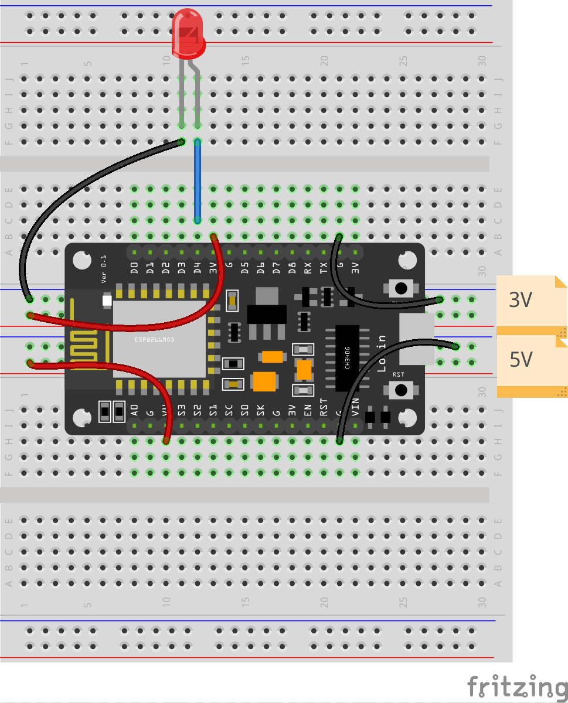

# Ejemplos

## 1 - Parpadeo

[Código: 1-Parpadeo.ino](codigo/1-Parpadeo/1-Parpadeo.ino)

## 2 - LCD

[Código: 2-LCD.ino](codigo/2-LCD/2-LCD.ino)

## 3 - LCD y Sensor de temperatura DHT

[Código: DHT-LCD](codigo/3-DHT-LCD/3-DHT-LCD.ino)

## 4 - LCD, DHT y wifi

[Código: 4-DHT-LCD-Wifi/4-DHT-LCD-Wifi](codigo/4-DHT-LCD-Wifi/4-DHT-LCD-Wifi.ino)

## 5 - LCD, DHT y sensor de humedad de suelo

[Código: DHT-LCD-Wifi-HSuelo ](./codigo/5-DHT-LCD-Wifi-HSuelo/5-DHT-LCD-Wifi-HSuelo.ino)
  5
