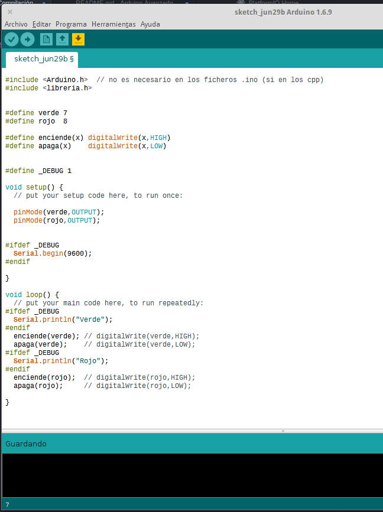

# Proceso de compilación en C++ y en Arduino

Es importante saber cómo es el proceso de compilación de nuestro código para así poder entender el funcionamiento de algunas cosas.

# Fases del proceso de compilación

Se realiza en 3 fases y es muy importante el orden

## Preprocesado
* Includes: se includen todos los ficheros (de manera recursiva, el include  que include un fichero...)
* Defines: se sustituyen las etiquetas por su valor
* Directivas de preprocesado: se validan y se decide qué código se usa y cual no

## Compilado

* Se valida la sintaxis, se revisan la declaración de todas las variables, se validan los tipos, expresiones, etc...
* Se genera un código objeto

## Enlazado ("Linkado")
* Se juntan todos los códigos objetos (de los diferentes ficheros) y de las librerías usadas
* Se verifica que no falten símbolos
* Se genera el ejecutable

En este vídeo explicamos el proceso con un [Ejemplo](./Preprocesador/Preprocesador.ino)

[Vídeo](https://youtu.be/ODG07Y9SIHc)

[Ejemplo](./Preprocesador/Preprocesador.ino)
