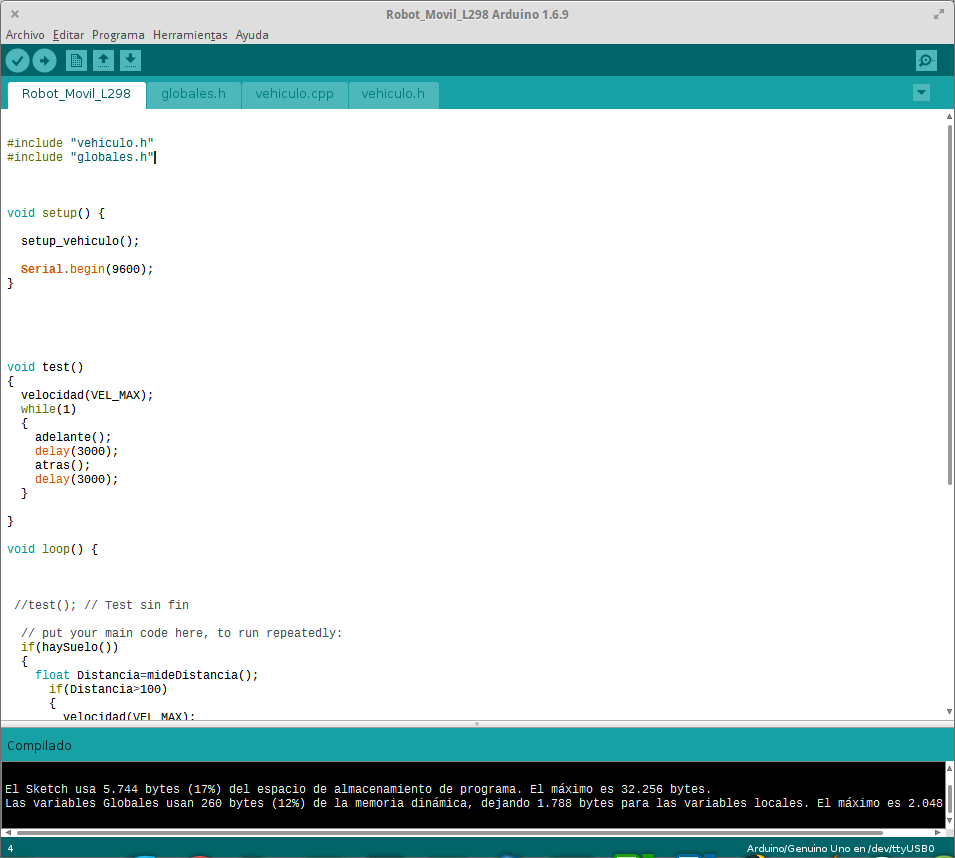

En este ejemplo vemos como dividir un proyecto Arduino en varios ficheros con el fin de hacerlos más comprensible, ampliable y en un futuro crear una librería a partir de este código

[Proyecto Inicial](./ProyectoOriginal) (1 sólo fichero)

[Proyecto Final](./ProyectoFinal) (4 ficheros)

En este [vídeo](https://youtu.be/PPsUHX6nVow) se explica cómo hacerlo con  [robot movil sencillo](https://github.com/javacasm/ArduinoAvanzadoBaeza/blob/master/proyectos/robot.md)
