# Arduino Avanzado Priego

CEP Priego-Montilla

Febrero-Abril de 2018

José Antonio Vacas @javacasm

## https://github.com/javacasm/ArduinoAvanzadoPriego

# Calendario

## Sesión 1 13-Febrero
* Repaso de programación y electrónica
  * [Contenido del kit](https://www.prometec.net/producto/kit-inicio/)
  * Usando Leds como salidas [digitales](./Repaso/programacion.md#sem%C3%A1foro)
  * [Sensores](./Repaso/programacion.md#medidas-con-sensores)
  * [Simuladores](./Repaso/3.5_Simuladores.pdf)

* Materiales de Consulta  
  * [Introducción a la electrónica](./Repaso/0.4_IntroduccionElectr%C3%B3nica.pdf)
  * [Introducción a la programación](./Repaso/1.1.1_IntroduccionProgramacion.pdf)
  * [Montajes básicos](./Repaso/1.1.3_IntroduccionMontajes.pdf)
  * [Modelos de Arduino](./Repaso/ComparacionHardware.pdf)
  * Diseño de circuitos con [Fritzing](./Repaso/Fritzing.pdf)
  * [Entorno de programación](./IDES.md)

### Prácticas:
  * [Regulación de duración de parpadeo con potenciómetro](./codigo/Blink_pot/Blink_pot.ino)

  * [Medida de humedad o salinidad](./codigo/Humedad_Saturacion_salina/Humedad_Saturacion_salina.ino)
  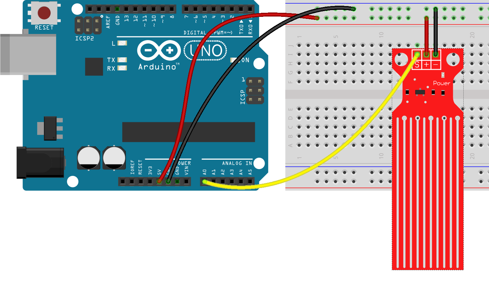
  * [Sistema de Riego](./codigo/Sistema_Riego/Sistema_Riego.ino)
  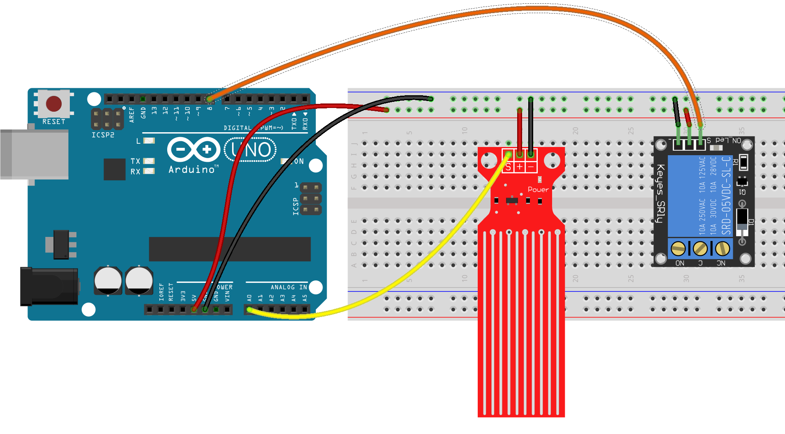

### Tarea voluntaria

* Fijar el umbral de riego mediante un potenciómetro

  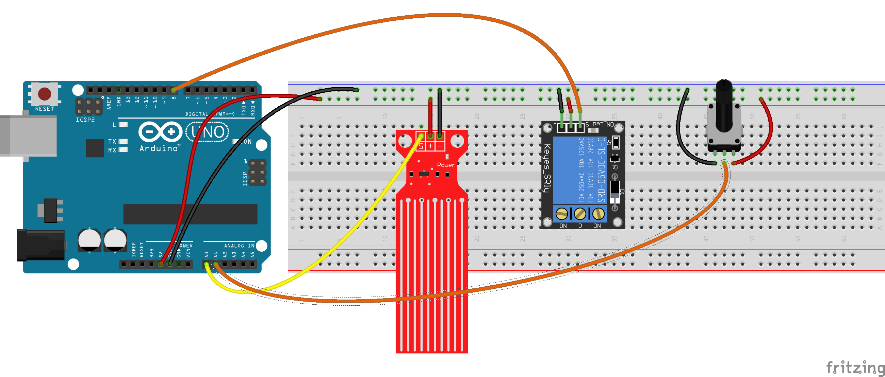

* Ahora podemos hacer que el valor del potenciometro regule el [valor de disparo del riego](./codigo/Sistema_Riego_REgulable/Sistema_Riego_REgulable.ino)

* Una vez montado el circuito calibramos los valores de humedad, lo que nos dará un valor de lo que consideramos seco VALOR_SECO y húmedo VALOR_MOJADO. Además definiremos un valor de HISTERESIS que evitará que se produzcan Enciendos/Apagados de manera rápida e intermitente

[Codigo](./codigo/Sistema_Riego_REgulable_calibrado/Sistema_Riego_REgulable_calibrado.ino)

## Sesión 2 19-Febrero
* Control de brillo de le Led con  [PWM](./Repaso/programacion.md#salidas-anal%C3%B3gicas)

* Uso de display [LCD](./Repaso/2.1.6_DisplayLCD.pdf)
* [Librerías](./Repaso/1.2.4_ProgramaciónAvanzadaLibrerías.pdf)  
* Lectura de sensores:
  * Sensores de humedad y temperatura ([DHT](./Repaso/DHT.pdf))
* Material de consulta
  * [Montajes y tipos de Sensores](https://github.com/javacasm/ArduinoAvanzadoPriego/blob/master/Repaso/Sensores.pdf)
  * Sensores de temperatura ([LM35](./Repaso/LM35.pdf))

### Prácticas:
  * Ciclo de color con led RGB

  [Proyecto de tinkercad](https://www.tinkercad.com/things/2v5LHQa9nd1)

  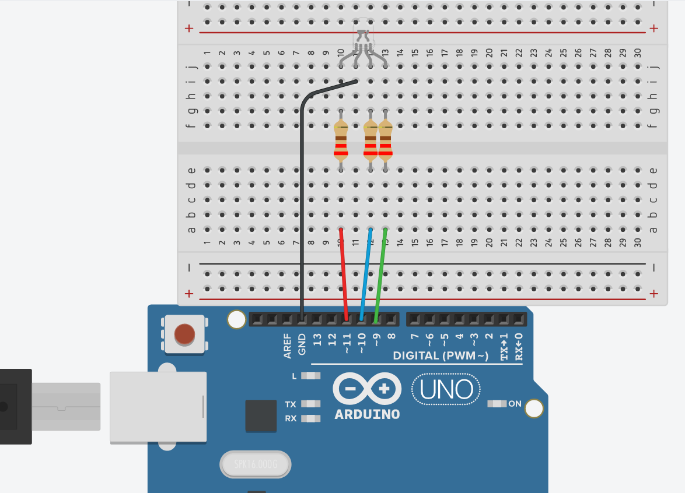
  * Lectura de temperatura
    * Instalamos Libreria SimpleDHT  con el gestor de temperatura (Menu -> Programa -> Inclluir libreria -> Gestor Librerias)
    * Abrimos el  Ejemplo de la libreria "SimpleDHT" DHT11Default
    * Conectamos el sensor DHT11 segun la imagen
      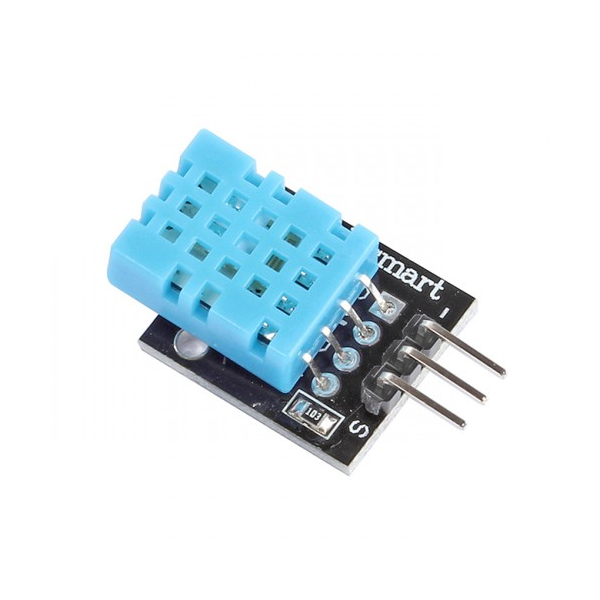
      (Cuidado con la velocidad del puerto serie que debe ser 9600)
  * Test de pantalla LCD I2C
    * Instalamos la libreria LiquidCrystal I2C
    * Abrimos el ejemplo de la libreria "LiquidCrystal I2C" HelloWorld
    * Cambiamos la direccion del LCD ( Puede ser 0x27 o 0x30 o 0x3F) (Podemos buscar el valor usando ["I2C Scanner"](./codigo/i2c_scanner/i2c_scanner.ino))
    * Conectamos el LCD
    * Ajustamos el contraste con el potenciómetro de la placa
  * Estación meteorológica
    * Mezclamos los 2 ejemplos usados, copiando a un tercero
     [Código](./codigo/Estacion_Meteorologica/Estacion_Meteorologica.ino)

### Tarea
Vamos a controlar el color de un led RGB con 3 potenciometros (en el kit tenemos 1 potenciómetro y con el joystick podemos simular otros 2 (VrX y VrY))

[Proyecto en Tinkercad](https://www.tinkercad.com/things/48ZTGqClfOM)

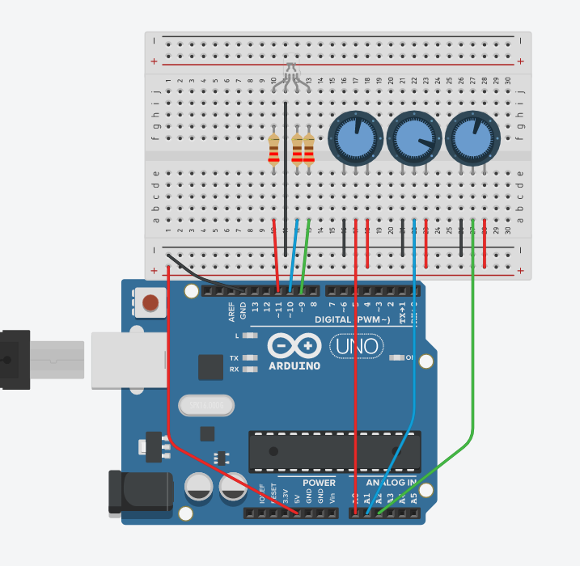

[Código](./codigo/Control_Pots_LedRGB/Control_Pots_LedRGB.ino)

## Sesión 3 5-Marzo
* [Pulsadores](/Repaso/programacion.md#detectar-una-pulsaci%C3%B3n)

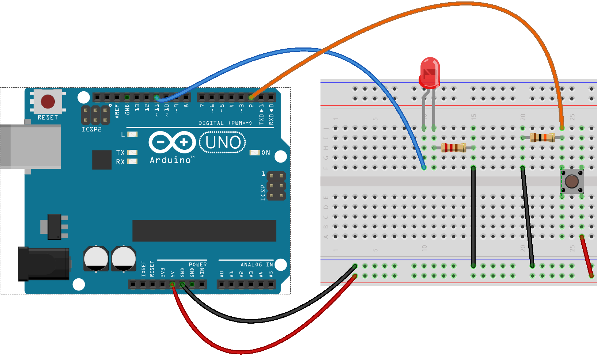

Conectamos por medio de una resistencia (de 10kOhmios) el pin de arduino a GND de manera que cuando no esté activado el pulsador la patilla reciba 0V. Al pulsarlo se conectará a 5V

Es lo que se conoce como conexión Pull-Down

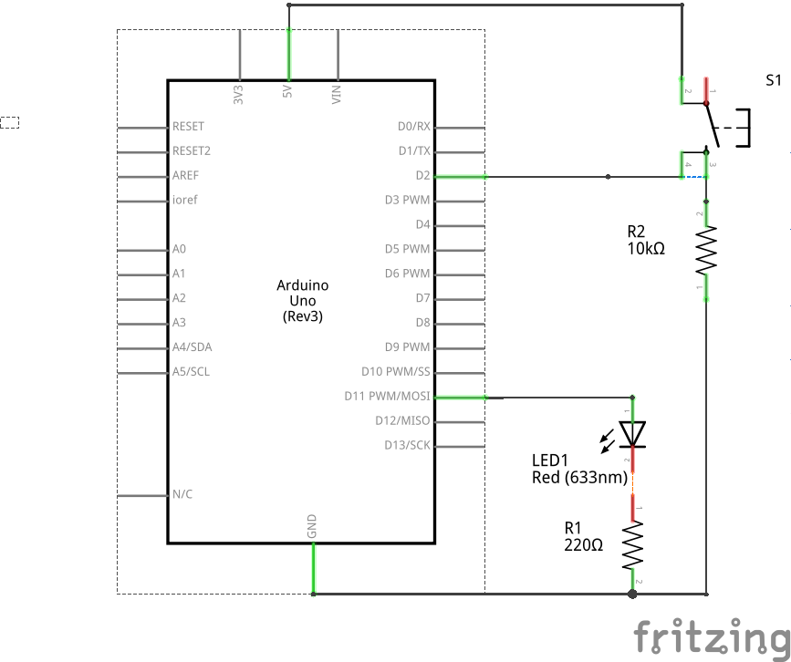

* [Secuencias](./Secuencias.md)

  Una secuencia es un conjunto de instrucciones que se realiza en determinado orden.

  Ejemplos de secuencias son un semáforo, o el programador de una lavadora

  Trabajaremos con el ejemplo del semáforo

  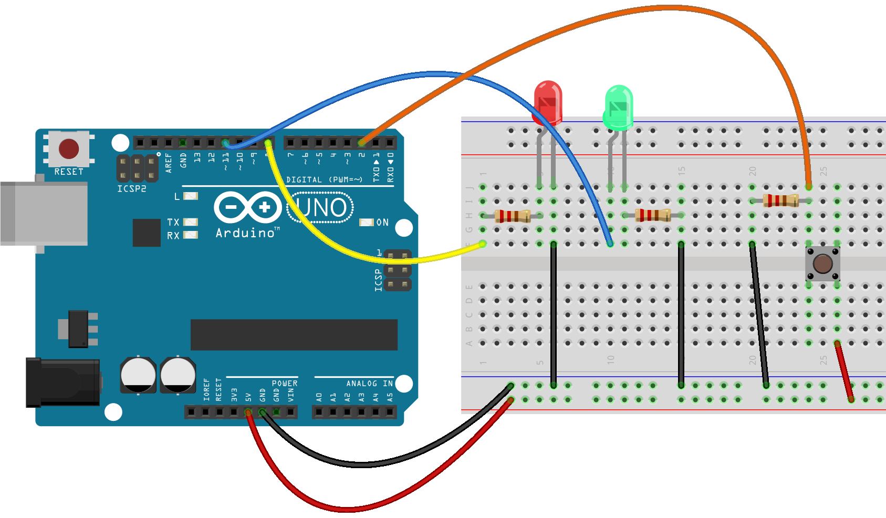

  En nuestro caso un pulsador hará el cambio entre los estados.

  Si el tiempo de espera entre los estados es alto y usamos delay() veremos que el sistema responde lentamente.

  Para ello dividiremos el tiempo de espera en esperas más cortas entre las que comprobaremos el estado del pulsador

        int duracion_rojo = 60000;
        int numero_iteraciones = 1000;
        for(int i = 0 ; i < numero_iteraciones ; i = i + 1 ){
          delay(duracion_rojo / numero_iteraciones);
          if (digitalRead(PIN_PULSADOR) == HIGH ){
             break;
          }
        }

* [Proceso de compilación](ProcesoCompilación/README.md)
* [Interrupciones](./Interrupciones.md) [Hardware](./Repaso/2.1.3_InterrupcionesHardware.pdf) y [Software](./Repaso/1.2.2_ProgramacionAvanzadaInterrupcionesSoftware.pdf)

### Lecturas complementarias

* [Programación C++ avanzada](./Repaso/1.2.3_ProgramacionAvanzadaCavanzado.pdf)

### Prácticas:
* [Semáforo secuencial](./codigo/Semaforo_Secuncia/Semaforo_Secuncia.ino)
* [Semáforo con pulsador](./codigo/Semaforo_PUlsador/Semaforo_PUlsador.ino)
* [Semáforo con pulsador y parpadeo](./codigo/Semaforo_PUlsador_Parpadeo/Semaforo_PUlsador_Parpadeo.ino)
* [Semáforo y comprobación de pulsación](./codigo/Semaforo_Pulsador_Puoolling/Semaforo_Pulsador_Puoolling.ino)
* [Interrupciones Hardware](./codigo/interrupcion_Hardware/interrupcion_Hardware.ino)
* Interrupciones software (Ejemplo Interrupt de la librería TimerOne)

## Sesión 4 12-Marzo
* [Introducción a Internet de las Cosas](IOT.md) (IOT)
* Uso de placa wifi [NodeMCU](./NodeMCU.md) y el [shield de motores](./MotorShield.md) con el [IDE de Arduino](./ConfiguracionIDE.md)
* Familias del ESP8266

### Prácticas
* [Instalación de soporte para las placas ESP8266 en el IDE de Arduino](./ConfiguracionIDE.md)
* [Driver CP210x para Windows](https://www.silabs.com/products/development-tools/software/usb-to-uart-bridge-vcp-drivers) ([Alternativo](https://www.silabs.com/documents/public/software/CP210x_Windows_Drivers.zip))
* Ejemplo de parpadeo led: Ejemplo Blink (D0 o D4)

Usaremos el ejemplo Blink (Archivo-> Ejemplos -> 1.Basics -> Blink) para hacer que parpadee el led incluido en la placa NodeMCU

Vemos que el código en versiones modernas del IDE (1.8.x) se refiere al led como LED_BUILTIN, que equivaldrá a un led distinto en cada tipo de placa.
En nuestro caso según el fabricante será D0 o D4

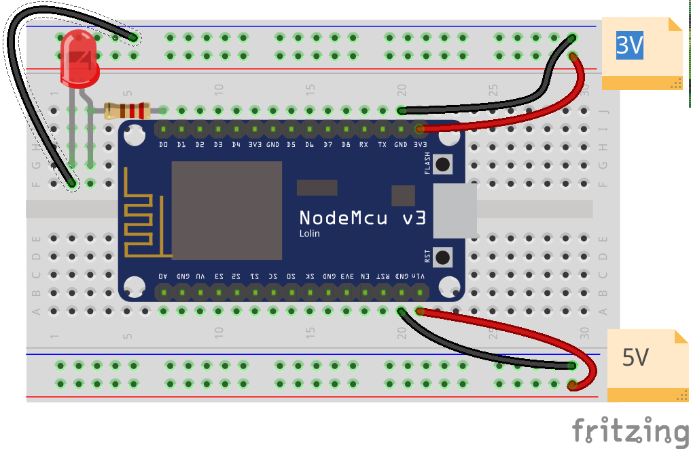

* Ejemplo de servidor web: Ejemplo ESP8266 WebServer:HelloServer
Usaremos el ejemplo de servidor web: Ejemplo ESP8266 WebServer:HelloServer

Debemos incluir el ssid y el password de nuestro wifi que se usarán en el setup para configurar la conexión wifi

Vemos que existen funciones que se encargan de manejar cada URL

  handleRoot() maneja la URL razi
  handleNotFound() es la que envía el mensaje de error 404 de página no encontrada

En la siguiente sesión lo integraremos con el código del sensor DHT para publicar los datos de temperatura y humedad
* Adaptación al NodeMCU de la estación meteorológica con wifi con publicación online de datos

## Sesión 5 15-Marzo
* Estación meteorológica con NodeMCU
  * LCD ([Libreria](codigo/ESP8266-I2C-LCD1602.zip))

  

  * DHT

  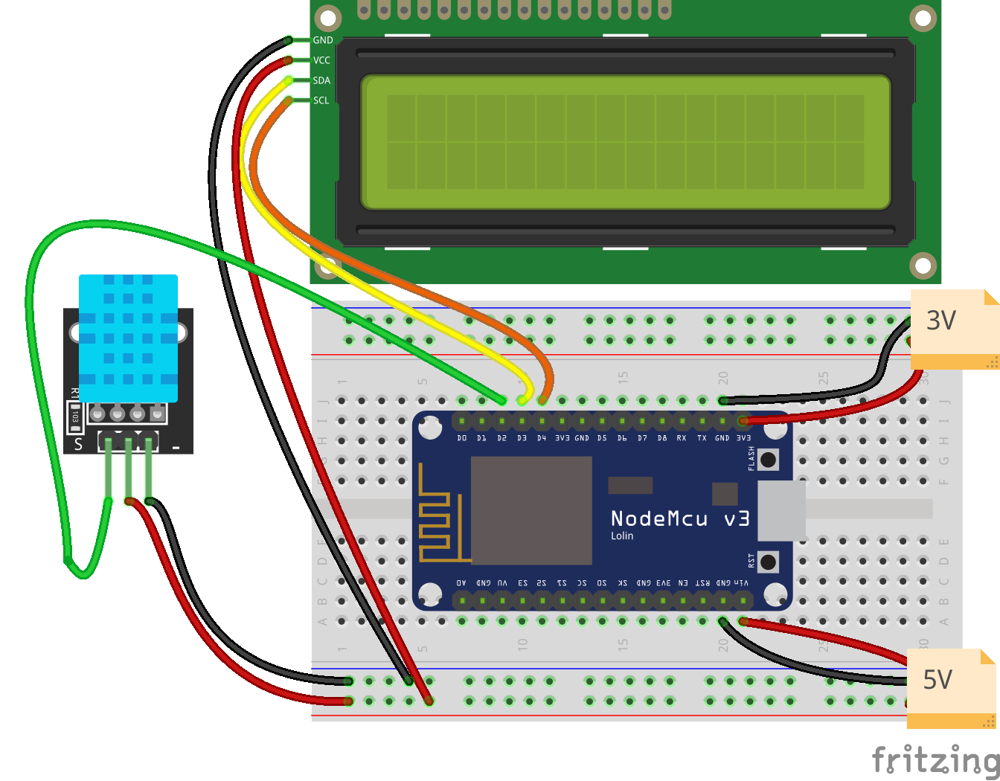

  * Rele

  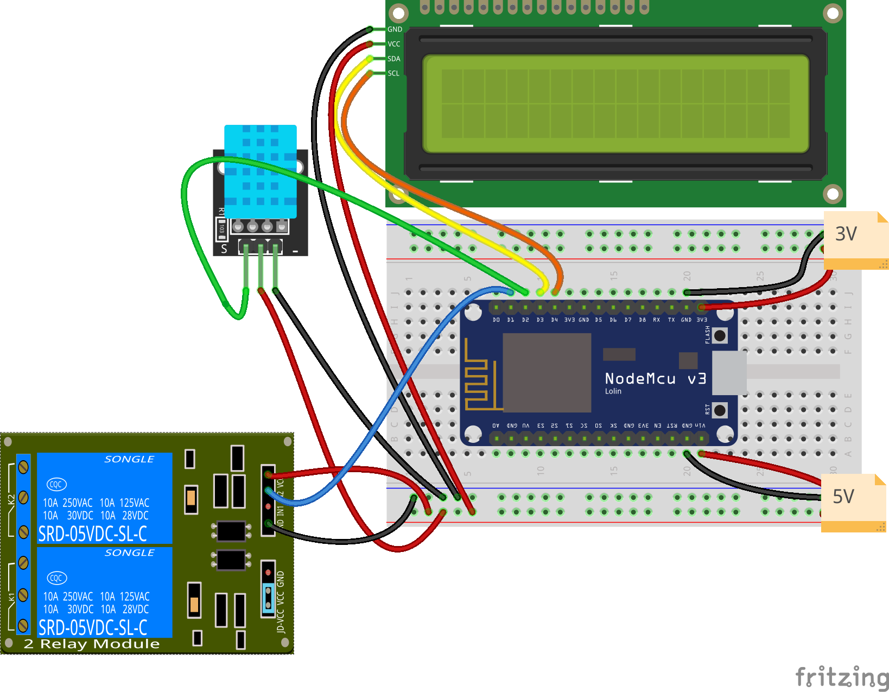

  * Hora via [NTP](./codigo/NTP)
  * Página web sencilla

  Vamos a modificarlo para que incluya los datos de un sensor ficticio.

      void handleRoot() {
           digitalWrite(led, 1);
           String CodigoPagina = "<html><Title>Datos Meteo</Title><body>";
           CodigoPagina +=       "
Temperatura = " + temp + "
";
           CodigoPagina +=       "
humedad = " + hum + "
";
           CodigoPagina +=       "</body></html>";
           server.send(200, "text/plain", CodigoPagina);
           digitalWrite(led, 0);
          }

* Publicación de datos via Web
* [Proyectos con varios ficheros](ProyectoVariosFicheros/README.md)
* Control de dispositivos via Wifi:
  * [Relé controlado via web](./codigo/ControlRelesWeb)

## Sesión 6 10-Abril
* Protocolos de envio de datos (REST, MQTT)
* Plataformas online ( Blink, Cayenne, Thingspeak, Thinger.io, etc.)
* Configuración de router, ip públicas, etc

### Recursos complementarios

* [Manejo de puertos en paralelo](./Repaso/1.2.1_ProgramacionAvanzadaPuertos.pdf) (Registros)
* [Control de potencia](./Repaso/ElectrónicaPotencia.pdf)
* Control de motores
  * [Motores CC](./Repaso/2.1.4_Motores.pdf)
  * [Paso a paso](./Repaso/stepper.md)
* [Lectura de tarjertas RFID](./RFid.md)
* [Control con Infrarrojos](./Repaso/3.7_Infrarrojos.pdf)
* Lectura de [tiempos (RTC)](./Repaso/4.2_RTC.pdf)
